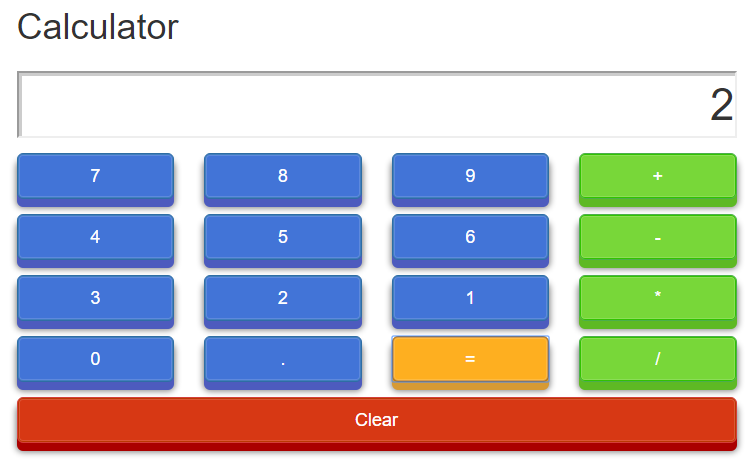

# Angular 2 Boot Camp

## Components exercise #1

-Inside the **/src/index.html** and **/src/styles.css** you will find the required HTML and CSS to create a calculator. If you run **ng serve** inside **/day2-components1/** you will be able to access **http://localhost:4200/** and see the calculator.

-You will need to create a feature module(calculator) that will contain a component with the requiered styles and template for the calculator.

-Do not forget to export the CalculatorComponent in the feature module and import it in the **root module**.

## Time Limit

30 minutes

## Components exercise #2

-.Create a component for the buttons that will be use in the calculator component.
-.Define the input and output properties for the new component.
-.Replace the <button> tags for our new component.

## Time Limit

1 hour

